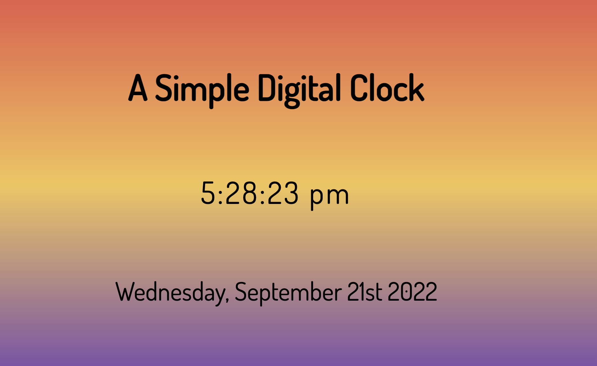

# digital_clock_app

 A simple digital clock displaying the time and date
 Languages Used:  HTML / CSS / JavaScript

View the application [here](https://jmurrii.github.io/digital_clock_app/)

## Summary
In the third exercise of Andy Sterkowitz' Software Development Mastermind Program, I was given the task of creating a digital clock application.
The project required me to research and understand JavaScript's Date Object.
Initially I had built one 'mega' function that did everything - but I learned that good practice is to break down the functionality
into smaller more manageable functions.
I also learned more about CSS and experimented with linear gradient to get a cool backdrop colour scheme.

## Author
John Murray - _Software Developer_
